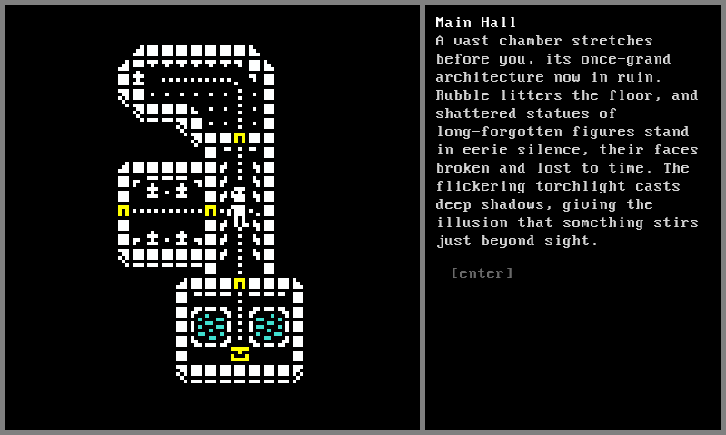

### Terminal Hero (name to be revised)
Simple text-based RPG. Written in Python using the Pygame library.

Game design document can be found in [design](design/)

Running the main game 
```
>>> ./game.py -h
usage: game.py [-h] [-v] [-d] [-a]

options:
  -h, --help     show this help message and exit
  -v, --verbose  log debug and info statements
  -d, --dialog   test dialog
  -c, --companion  test a companion in the player party
  -a, --all        enable all player_log fields
```

Helper script included for visualizing dialog trees:
-  An example of this can be found in [elder_varik.mermaid.md](resources/examples/elder_varik.mermaid.md)
```
>>> dialog/dialog_display.py -h
usage: dialog_display.py [-h] filename

positional arguments:
  filename

options:
  -h, --help  show this help message and exit
```




- Using a modified version of Urizen 1Bit Tileset: https://vurmux.itch.io/urizen-onebit-tileset
- Using a modified version of Kenney 1-Big Pack: https://kenney-assets.itch.io/1-bit-pack
- Using ChatGPT for placeholder dialogue and for fleshing out the game design documents.
- Using [mermaid.js](https://mermaid.js.org/) to visualize dialog trees using the script found in [dialog/dialog_display.py](dialog/dialog_display.py).

### Rough To-Do List (Unordered)
**Area**
- Encounters should have descriptive text that is displayed in the area screen in red
- NPCs should be shown in cyan
- Dynamic area descriptions based on the player log

**Quest**
- Quest Steps should have NPCs and Locations, to highlight important steps for the player
- Areas should show quest options as yellow (or with an exclamation point or something)
- World Screen should highlight quest areas
- Quest Log icon at the bottom of the world screen that highlights if changes have been made to the quest log
- Quest log will probably require scrolling
- For now, get rid of main + side quests, just have "Quests" and "Complete"

**Combat**
- Get rid of the funny `qwerasdf` targeting. Instead use arrow keys and highlight targeted enemies (possibly multiples).
  - This also allows showing hit chance, damage, and status effects
  - And allows preventing illegal targeting, etc
- Flee combat? Or just reload previous save lol
- Print the correct post-resistance damage numbers in ability effects before the damage is dealt (in case they die)
- Figure out a concise way to let party members know that their allies are the players party
- When balancing, increase all numbers by a bit. This will allow resistances to actually be felt (10% resistance doesn't matter if the damage is like 4)

**Dungeons**
- Dungeons refresh enemies if the player leaves before completing them (defeating boss?)
  - Prevents pseudo save-scumming by finishing each encounter and returning to tavern to full heal before coming back
  - Not that the tavern is a thing yet lol
- Dungeon features that the player can actually interact with, the text describing them should be coloured
- Only show the big dungeon entrance notification the very first time that dungeon is entered
- No longer go into AreaScreens using Rooms, just do combat and all room interacts directly from the DungeonScreen

**Status Effects**
- Display status effect icon instead of name, effect screen that can be opened in combat to list all status effects off
  - Sort the list by showing currently active ones first

**Dialogue**
- Somehow mark dialogue options that have not been chosen yet
    - Mark the NPC if they have unread dialogue
    - Arrow-key control for dialogue options
- Show the sprite of the NPC you are talking to

**Equipment**
- Magic weapons buff damage of a particular type?
- Get rid of key items? I feel like these as a separate list arent useful, just flag them and border them in blue or something in the inventory screen

**Saving**
- This is going to be a bit of an issue

**Other**
- Allow stacking several notifications at once
- A screen to store known lore ([J]ournal?)
- Creature screen rapidly overflows with abilities, add new ability screen that can be accessed from creature screen (or straight from combat)
- Party Screen to view party members
  - Show max of each stat for dialogue skill checks
- Character screen to view self, [tab] to swap to next character in party
- New constant of `FONT_HEIGHT + 2`
