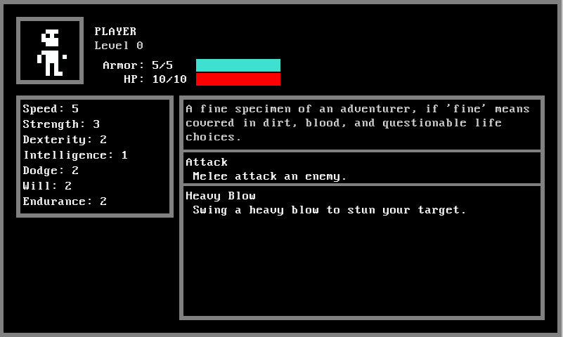

### Terminal Hero (name to be revised)
Simple text-based RPG. Written in Python using the Pygame library.

Game design document can be found in [design](design/)

Running the main game 
```
>>> ./game.py -h
usage: game.py [-h] [-v] [-d] [-a]

options:
  -h, --help     show this help message and exit
  -v, --verbose  log debug and info statements
  -d, --dialog   test dialog
  -c, --companion  test a companion in the player party
  -a, --all        enable all player_log fields
```

Helper script included for visualizing dialog trees:
-  An example of this can be found in [elder_varik.mermaid.md](resources/examples/elder_varik.mermaid.md)
```
>>> dialog/dialog_display.py -h
usage: dialog_display.py [-h] filename

positional arguments:
  filename

options:
  -h, --help  show this help message and exit
```




- Using a modified version of Urizen 1Bit Tileset: https://vurmux.itch.io/urizen-onebit-tileset
- Using a modified version of Kenney 1-Big Pack: https://kenney-assets.itch.io/1-bit-pack
- Using ChatGPT for placeholder dialogue and for fleshing out the game design documents.
- Using [mermaid.js](https://mermaid.js.org/) to visualize dialog trees using the script found in [dialog/dialog_display.py](dialog/dialog_display.py).

### Rough To-Do List (Unordered)
**Area**
- Encounters should have descriptive text that is displayed in the area screen in red
- NPCs should be shown in cyan
- Dynamic area descriptions based on the player log

**Quest**
- Quest Steps should have NPCs and Locations, to highlight important steps for the player
- Areas should show quest options as yellow (or with an exclamation point or something)
- World Screen should highlight quest areas
- Quest Log icon at the bottom of the world screen that highlights if changes have been made to the quest log

**Combat**
- Creature combat abilities show hit chance, damage, and effects when targeting
- Instead of just removing enemies from combat, leave them at 0 HP and show their corpse

**Dungeons**
- Specialized areas, the player will move around a series of rooms laid out on a grid and must explore the area to complete it.
- Entering a room with an encounter will automatically trigger it
- Otherwise entering rooms can open an area screen of the room with various interactions
  - Room as subclass of Area?

**Status Effects**
- Display status effect icon instead of name, effect screen that can be opened in combat to list all status effects off
  - Sort the list by showing currently active ones first

**Dialogue**
- Somehow mark dialogue options that have not been chosen yet
    - Mark the NPC if they have unread dialogue
    - Arrow-key control for dialogue options
- Show the sprite of the NPC you are talking to

**Equipment**
- Your equipped weapon should determine some of the abilities each character has
  - Other abilities related to the class
- Weapon should also determine character sprite
- Keep equipment rather slim, maybe only a weapon and an armor (and trinket?)

**Saving**
- This is going to be a bit of an issue

**Other**
- Allow stacking several notifications at once
- A screen to store known lore ([J]ournal?)
