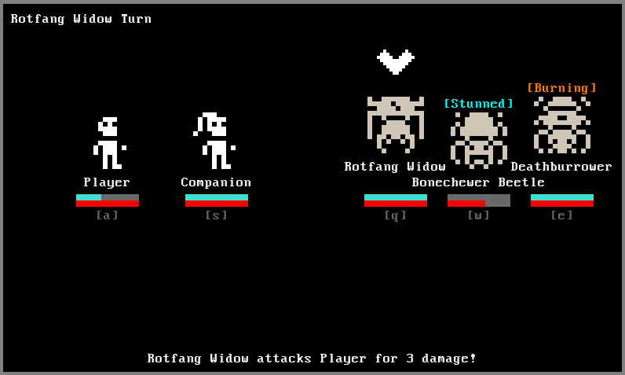
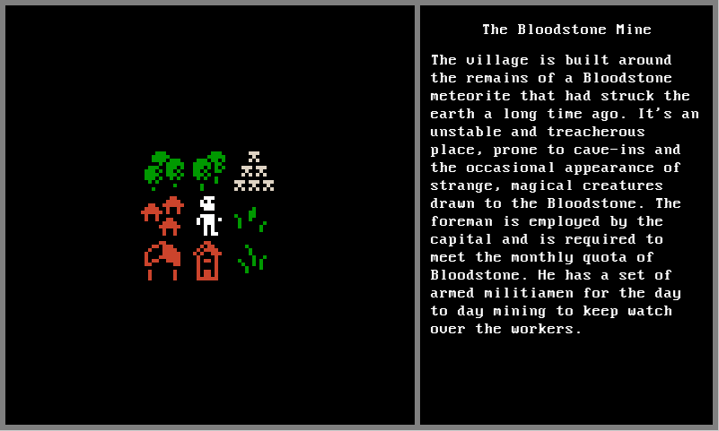
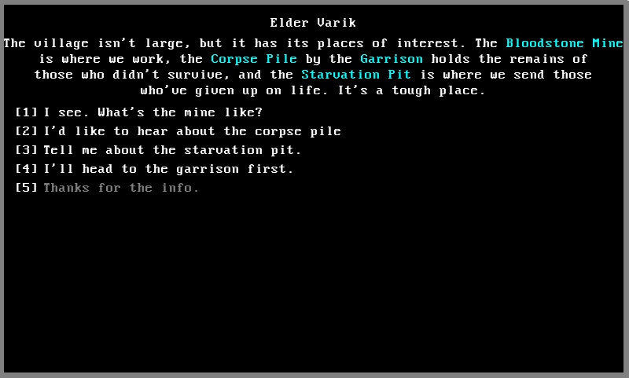

### Terminal Hero (name to be revised)
Simple text-based RPG. Written in Python using the Pygame library.

Game design document can be found in [design](design/Act%20I/)

Running the main game 
```
>>> ./game.py -h
usage: game.py [-h] [-v] [-d] [-a]

options:
  -h, --help     show this help message and exit
  -v, --verbose  log debug and info statements
  -d, --dialog   test dialog
  -c, --companion  test a companion in the player party
  -a, --all        enable all player_log fields
```

Helper script included for visualizing dialog trees:
-  An example of this can be found in [elder_varik.mermaid.md](resources/examples/elder_varik.mermaid.md)
```
>>> dialog/dialog_display.py -h
usage: dialog_display.py [-h] filename

positional arguments:
  filename

options:
  -h, --help  show this help message and exit
```





- Using a modified version of Urizen 1Bit Tileset: https://vurmux.itch.io/urizen-onebit-tileset
- Using a modified version of Kenney 1-Big Pack: https://kenney-assets.itch.io/1-bit-pack
- Using ChatGPT for placeholder dialogue and for fleshing out the game design documents.
- Using [mermaid.js](https://mermaid.js.org/) to visualize dialog trees using the script found in [dialog/dialog_display.py](dialog/dialog_display.py).

### Rough To-Do List (Unordered)
**Quests**
- Quest screen to display quest progress
- Quests should move to a `finished_quests` list once complete

**Area**
- Encounters should have descriptive text that is displayed in the area screen

**Combat**
- Creature combat abilities show hit chance, damage, and effects when targeting
- Don't allow stacking of the same status effect on a single creature
- Status effects interact with each other (ie. enemy engulfed in poison will explode when dealt fire damage)
- Screen to inspect creatures, their description and details, when selecting them without an ability active
- Show health and armor numbers

**Dialogue**
- Somehow mark dialogue options that have not been chosen yet
    - Mark the NPC if they have unread dialogue
    - Arrow-key control for dialogue options
- Coloured words in dialogue to highlight important things
- Player can add characters to their party through dialogue
- Basic quests and quest completion through combat or dialogue

**Equipment**
- Your equipped weapon should determine some of the abilities each character has
  - Other abilities related to the class
- Weapon should also determine character sprite
- Keep equipment rather slim, maybe only a weapon and an armor (and trinket?)

**Saving**
- This is going to be a bit of an issue
