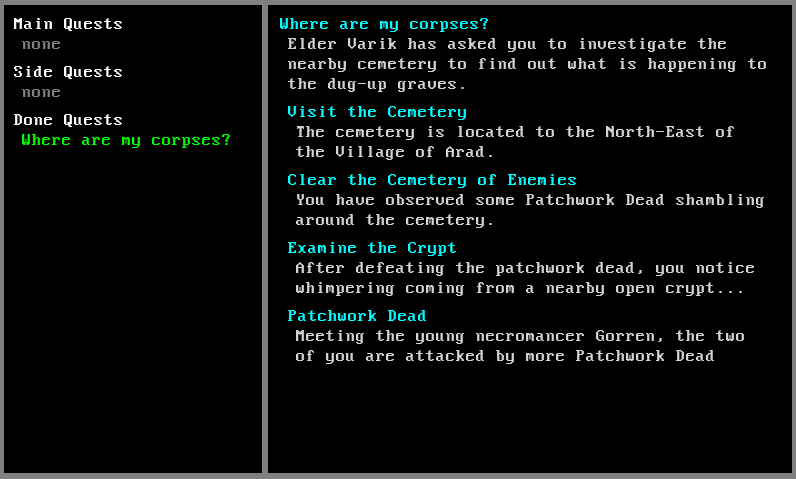

### Terminal Hero (name to be revised)
Simple text-based RPG. Written in Python using the Pygame library.

Game design document can be found in [design](design/)

Running the main game 
```
>>> ./game.py -h
usage: game.py [-h] [-v] [-d] [-c] [-a] [-l LOG] [-u DUNGEON] [-r] [-e] [-s] [-i]

options:
  -h, --help            show this help message and exit
  -v, --verbose         log debug and info statements
  -d, --dialog          test dialog
  -c, --companion       test a companion in the player party
  -a, --all             enable "all" player_log fields
  -l LOG, --log LOG     comma separated list of player_log entries to start with
  -u DUNGEON, --dungeon DUNGEON
                        test dungeon display by name
  -r, --revealed        for dungeon mode, set all rooms as revealed
  -e, --no-enemies      for dungeon mode, remove all encounters
  -s, --stats           gives the player massively enhanced stats
  -i, --inventory       show the inventory test screen
```

Helper script included for visualizing dialog trees:
-  An example of this can be found in [elder_varik.mermaid.md](resources/examples/elder_varik.mermaid.md)
```
>>> dialog/dialog_display.py -h
usage: dialog_display.py [-h] filename

positional arguments:
  filename

options:
  -h, --help  show this help message and exit
```





- Using a modified version of Urizen 1Bit Tileset: https://vurmux.itch.io/urizen-onebit-tileset
- Using a modified version of Kenney 1-Bit Pack: https://kenney-assets.itch.io/1-bit-pack
- Using ChatGPT for placeholder dialogue and for fleshing out the game design documents.
- Using [mermaid.js](https://mermaid.js.org/) to visualize dialog trees using the script found in [dialog/dialog_display.py](dialog/dialog_display.py).

### Rough To-Do List (Unordered)
**Area**
- Encounters should have descriptive text that is displayed in the area screen in red

**Quest**
- Quest Steps should have NPCs and Locations, to highlight important steps for the player
- Areas should show quest options as yellow (or with an exclamation point or something)
- World Screen should highlight quest areas
- Quest Log icon at the bottom of the world screen that highlights if changes have been made to the quest log
- Quest log will probably require scrolling
- Quests ping you when you finish individual steps? Maybe "Quest Log Updated" notification

**Combat**
- Abilities show hit chance, damage, and status effects, when selected
  - Hit chance should be a separate function that returns a percentage
  - Can also show a brief description here
- Flee combat? Or just reload previous save lol
- Only show the name of targeted creatures or the active creature
  - This means we don't need to stagger their positions anymore
- Combat backgrounds: Creatures stand on a floor and have some darkened background art
- Actual ability animations
- Effects that trigger on taking damage (ex: take damage that would kill you, remove the effect and go to 1 hp instead)
- When there is a lot of text it goes by very quickly, maybe stagger it better with timing if multiple things happen at once?
  - Move the combat log to the top of the screen?
- Position enemy sprites bottom aligned, so that we can have enemies bigger than 12x12 (bosses should be 16x16)
- Have a target_highlight function or something so that abilities like Rainstorm and Rallying Cry will show what creatures they will affect, even though you target yourself
- Edit flickering_flames to pass it a Damage object instead of just a number

**Dungeons**
- Dungeons refresh enemies if the player leaves before completing them (defeating boss?)
  - Prevents pseudo save-scumming by finishing each encounter and returning to tavern to full heal before coming back
- Only show the big dungeon entrance notification the very first time that dungeon is entered
- A Bloodstone Pouch that allows the party to full-heal during dungeons. This can increase in size over time. You unlock the pouch the first time you get a companion.
- Make the dungeon exit an actual feature instead of a funny "walk this way to leave" thing

**World**
- Draw the world like how dungeons are drawn, instead of using tiles
  - This can't just turn into a dungeon because I still want Area Screens and you can't just walk around to explore it (ie. keep the interface the same for now)

**Dialogue**
- Somehow mark dialogue options that have not been chosen yet
    - Mark the NPC if they have unread dialogue
    - Arrow-key control for dialogue options
- Show the sprite of the NPC you are talking to
- Coloured text should wrap properly
- Dialogue player stats: Persuasion, Intimidation, Insight, Investigation, Stealth, History, Survival, Religion
- Dialogue that loads directly into combat or other screens

**Items**
- Magic weapons buff damage of a particular type?
- Implement currency and limited product at stores, do we want stores to reset every so often?
  - Maybe they just get new items when certain player_log entries are set
- Rare food from special merchants?

**Screens**
- A screen to store known lore ([J]ournal?)
  - Include a section for known food
- Creature screen rapidly overflows with abilities, add new ability screen that can be accessed from creature screen (or straight from combat)
- Party Screen to view party members
  - Show max of each stat for dialogue skill checks
- Character screen to view self, [tab] to swap to next character in party
- Lots of overlap between StoreScreen and InventoryScreen, should be condensed
- Dialogue Screens have art, backgrounds with the characters speaking
- Messages Screen: View past messages, we already store 100 of them
  - To be used in combat, but also during dialogue and main screens

**Creatures**:
- Get secondary stats and resistances correctly to account for base (str,dex,int,wis) stats
  - ie. getting a creature's fire resistance should include the benefit from having high wisdom
- Since creature turns are determined based on their abilities, we might not need to give them specific AIs anymore
- Professions should give the creature starting equipment, rather than the creature factory doing it
  - We could consider choosing a profession gives the abilities to the creature, rather than the creature listing off their abilities + professions abilities
- Instead of storing open stat and ability points in Creature, we could store spent points. Then the level_up_handler could just keep track of total points that are allowed to be spent.
  - Would be easier to keep track, then it wouldn't need to keep a reference to creatures

**Saving**
- Serialize Creatures:
  - Store all atomic values
  - Creature.sprite: Doesn't need to store the caches but need to store everything else
  - Creature.abilities: Store by Ability name
  - Creature.profession: Store by Profession name
  - Creature.base_damage: Store this by calling Damage.get()
  - Creature.equipment: Store as dict(str, Equipment.name)
  - Creature.effects: This should always be empty
  - Creature.food: Store as name instead of object
  - Player.party: Store as creature ids
  - Player.area: Store as None for now
- Save and Load player_log
- Save and Load Inventory
- Save and Load messages
- An Escape screen that you can select Save or Load from, also Load from start screen
- Set encounters to clone their enemies into the CombatScreen when combat begins
- Remove Encounter.finished and instead populate the player log with it
- Remove Room.revealed from dungeon rooms, instead store it in player_log like encounters
- Fix locked doors
- Fix QuestSteps
- Load Quests by name/id
- Save and Load Level Up Handler, will need to reference each companion
  - For now, don't bother saving companions. Each should already be referenced by this, so we can just use already loaded ones.
- Fix Escape screen for loading, allow loading from non-world screens
  - World may need to be decoupled from Game
  - You can only Save from World, Dungeons, Area, you can Load from anywhere
- Load the player in the correct area
	- This means we will always load into either the World or the Dungeon screen, which is acceptable
  - Set both Area.player and Player.area
- Ensure that all of the handlers that get imported are reset upon loading.
  - inventory, quest_handler, level_up_handler
- Unit Tests:
	- Create a World, save World, load World, hash both objects and see if they are the same

**Other**
- New constant of `FONT_HEIGHT + 2`
- Mouse controls
- If you have unlocked all 6 companions, you unlock a bonus area of a pond with a magic frog.
  - The frog says random sentences at you in dialogue that sound very wise but are either nonsense or unrelated.
- I wonder if we should store creatures, encounters, dungeons, areas, all in their own quest packages
  - We probably don't need factories at all since we are loading every one as _ anyway
  - We probably just don't need the EffectFactory lol
- Rename draw_sprite to draw_from_rect, rename draw_creature to draw_sprite, handle dest coords better
- Separate combat log from dialogue log for recording history
