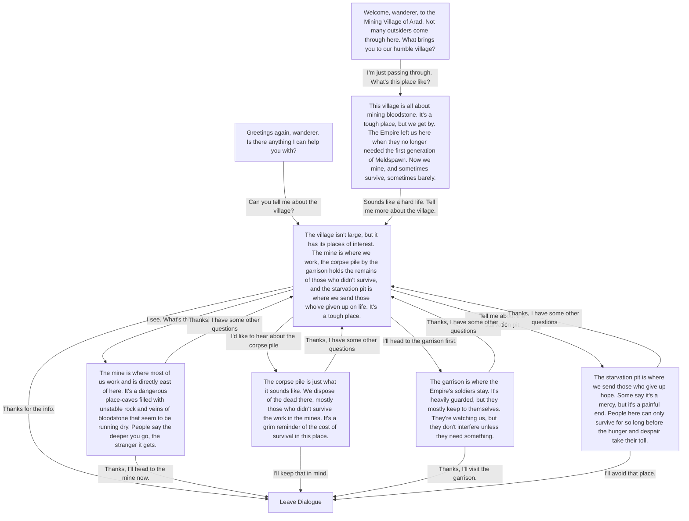

```mermaid
---
title=elder_varik.json
---
flowchart TB
	initial_node --> |I'm just passing through. What's this place like?| village_intro
	root_node --> |Can you tell me about the village?| village_info
	village_intro --> |Sounds like a hard life. Tell me more about the village.| village_info
	village_info --> |I see. What's the mine like?| mine_info
	village_info --> |I'd like to hear about the corpse pile| corpse_pile_info
	village_info --> |Tell me about the starvation pit.| starvation_pit_info
	village_info --> |I'll head to the garrison first.| garrison_info
	village_info --> |Thanks for the info.| None
	mine_info --> |Thanks, I have some other questions| village_info
	mine_info --> |Thanks, I'll head to the mine now.| None
	corpse_pile_info --> |Thanks, I have some other questions| village_info
	corpse_pile_info --> |I'll keep that in mind.| None
	garrison_info --> |Thanks, I have some other questions| village_info
	garrison_info --> |Thanks, I'll visit the garrison.| None
	starvation_pit_info --> |Thanks, I have some other questions| village_info
	starvation_pit_info --> |I'll avoid that place.| None
	initial_node[Welcome, wanderer, to the Mining Village of Arad. Not many outsiders come through here. What brings you to our humble village?]
	root_node[Greetings again, wanderer. Is there anything I can help you with?]
	village_intro[This village is all about mining bloodstone. It's a tough place, but we get by. The Empire left us here when they no longer needed the first generation of Meldspawn. Now we mine, and sometimes survive, sometimes barely.]
	village_info[The village isn't large, but it has its places of interest. The mine is where we work, the corpse pile by the garrison holds the remains of those who didn't survive, and the starvation pit is where we send those who've given up on life. It's a tough place.]
	mine_info[The mine is where most of us work and is directly east of here. It's a dangerous place-caves filled with unstable rock and veins of bloodstone that seem to be running dry. People say the deeper you go, the stranger it gets.]
	corpse_pile_info[The corpse pile is just what it sounds like. We dispose of the dead there, mostly those who didn't survive the work in the mines. It's a grim reminder of the cost of survival in this place.]
	garrison_info[The garrison is where the Empire's soldiers stay. It's heavily guarded, but they mostly keep to themselves. They're watching us, but they don't interfere unless they need something.]
	starvation_pit_info[The starvation pit is where we send those who give up hope. Some say it's a mercy, but it's a painful end. People here can only survive for so long before the hunger and despair take their toll.]
	None[Leave Dialogue]

```
